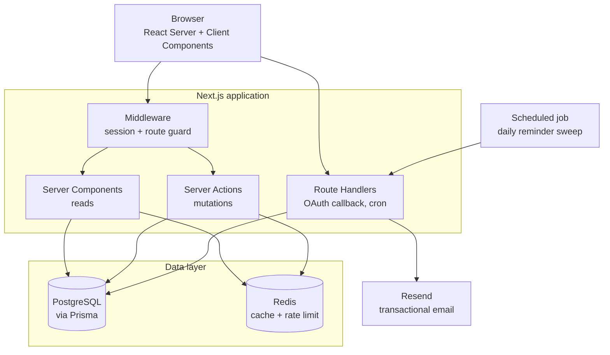
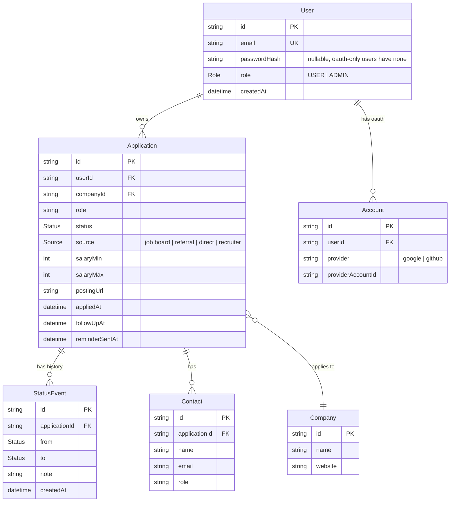

<div align="center">

# Job Application Tracker

**Track every application, its status, and follow-up reminders, so nothing slips through.**

[](https://nextjs.org)
[](https://www.typescriptlang.org)
[](https://www.postgresql.org)
[](https://www.prisma.io)
[](https://redis.io)
[](LICENSE)

</div>

---

## Build status

This project is built in public, one milestone at a time. The sections below describe the product as designed. The checklist is the honest picture of what actually runs today.

| # | Milestone | Status |
|---|---|---|
| 00 | Project setup, TypeScript, CI | ✅ |
| 01 | Data model, PostgreSQL, Prisma | ✅ |
| 02 | Credentials auth (JWT in httpOnly cookies) | ⬜ |
| 03 | OAuth sign-in (Google, GitHub) | ⬜ |
| 04 | Application CRUD with validated forms | ⬜ |
| 05 | Status pipeline and event history | ⬜ |
| 06 | Redis rate limiting and caching | ⬜ |
| 07 | Follow-up reminders via email | ⬜ |
| 08 | Analytics dashboard | ⬜ |
| 09 | Role-based access control | ⬜ |
| 10 | Deployment and hardening | ⬜ |

⬜ planned · 🟨 in progress · ✅ done

---

## Why this exists

I built this while job hunting myself.

Somewhere around the twentieth application the spreadsheet stopped working. Two companies had the same name in different rows, one interview date sat in a calendar the sheet knew nothing about, and a recruiter who had asked me to follow up "in about two weeks" got no reply for five. A spreadsheet stores data. It does not remind you of anything and it has no idea that "applied" and "waiting for feedback since 18 days" are different situations that need different reactions from you.

So the tracker is built around three things a spreadsheet cannot do. It models an application as something that moves through states and remembers every move. It watches the clock and emails you before a follow-up goes stale. And it turns the whole pile into numbers, so you can see which channel actually produces interviews instead of guessing.

---

## Features

### Application pipeline

Every application is a record with a company, a role, a source, a salary range, a link to the posting and free-form notes. It sits in exactly one status at a time and moves along a defined pipeline.

```
DRAFT → APPLIED → SCREENING → INTERVIEW → OFFER → ACCEPTED
                       ↓           ↓         ↓
                    REJECTED   REJECTED  DECLINED
                       ↓
                    WITHDRAWN (available from any active status)
```

Transitions are not free. The server validates that the requested move is legal for the current status, so an application cannot jump from `DRAFT` straight to `OFFER` because a stale browser tab said so.

Every transition is written to an append-only `StatusEvent` table. That gives each application a timeline you can read back, and it makes questions like "how many days do I usually sit in screening" answerable with a query instead of a memory.

A Kanban board renders the pipeline as columns with drag-and-drop between them. The board is a view on the same data, not a second source of truth.

### Follow-up reminders

Each application carries an optional `followUpAt` date. A scheduled job runs daily, finds everything that is due, and sends one email per user summarizing what needs attention.

The job is idempotent. A `reminderSentAt` timestamp per application means a retry, a double-triggered cron or a redeploy mid-run cannot produce a second email for the same follow-up.

Emails are transactional templates rendered with React Email and delivered through Resend.

### Analytics dashboard

Aggregations over the application and event tables, rendered as charts:

- Applications per week, stacked by current status
- Conversion funnel from applied through screening and interview to offer
- Response rate and median time to first response, broken down by source
- Average days spent in each pipeline stage
- Active applications that have gone quiet, ranked by days since the last event

The dashboard queries are the heaviest read path in the app, so the computed result is cached in Redis and invalidated whenever a `StatusEvent` is written for that user.

### Accounts and access

Two ways in. Email and password with credentials hashed using Argon2id, and OAuth through Google and GitHub. Both paths end in the same session, a signed JWT stored in an httpOnly, SameSite cookie.

Access control is role-based. A `USER` sees and edits only their own applications. An `ADMIN` reaches an operations view with aggregate platform metrics and no access to the content of anyone's applications. Authorization is enforced server-side on every mutation, so hiding a button in the UI is treated as cosmetics rather than as a security control.

Login and registration endpoints are rate-limited per IP and per account through a Redis sliding-window counter.

---

## Tech stack

| Layer | Choice | Why this one |
|---|---|---|
| Framework | Next.js 16, App Router | Server Components keep data fetching on the server, Server Actions remove the need for a separate REST layer for mutations |
| Language | TypeScript, strict mode | The pipeline is a state machine, and a union type of statuses turns an illegal transition into a compile error instead of a support ticket |
| Database | PostgreSQL 16 | Relational data with real foreign keys, plus window functions for the funnel and time-in-stage queries |
| ORM | Prisma 7 | Typed queries generated from the schema, and versioned migrations so the schema history is reviewable in git. Uses the `pg` driver adapter rather than a bundled engine |
| Cache & rate limiting | Redis 7 | Sliding-window counters on auth endpoints and a TTL cache for dashboard aggregates. Both need fast expiring keys, which is exactly what Redis is for |
| Email | Resend + React Email | Transactional delivery with templates written as components instead of hand-glued HTML strings |
| Validation | Zod | One schema validates the form on the client and the payload on the server, and infers the TypeScript type from the same definition |
| UI | Tailwind CSS, shadcn/ui | Component source lives in the repo and stays editable, no fighting a black-box design system |
| Testing | Vitest, Playwright | Unit tests on the transition logic, end-to-end tests on the auth and application flows |

---

## Architecture



Reads happen in Server Components and never reach the client as raw queries. Mutations go through Server Actions, which are the single place where authorization, validation and the transition rules are enforced. Route Handlers exist only for the two cases that need a real HTTP endpoint, the OAuth provider callback and the cron trigger.

---

## Data model



Two decisions worth calling out. `Company` is its own table rather than a string on the application, because the same employer showing up under three spellings would quietly break every aggregate. And `StatusEvent` is append-only, never updated and never deleted, which is what makes the timeline trustworthy and the time-in-stage analytics possible at all.

---

## Getting started

### Prerequisites

- Node.js 22 or newer
- Docker, for the local PostgreSQL and Redis containers
- A [Resend](https://resend.com) API key, only needed once you reach the reminder feature

### Setup

```bash
git clone https://github.com/aahmoh04/job-application-tracker-AM.git
cd job-application-tracker-AM

npm install
cp .env.example .env

docker compose up -d          # starts postgres + redis
npx prisma migrate dev        # applies migrations
npx prisma db seed            # optional demo data

npm run dev                   # http://localhost:3000
```

### Environment variables

| Variable | Purpose |
|---|---|
| `DATABASE_URL` | PostgreSQL connection string |
| `REDIS_URL` | Redis connection string |
| `JWT_SECRET` | Signing secret for session tokens |
| `NEXT_PUBLIC_APP_URL` | Public base URL, used for OAuth callbacks and email links |
| `GOOGLE_CLIENT_ID` / `GOOGLE_CLIENT_SECRET` | Google OAuth credentials |
| `GITHUB_CLIENT_ID` / `GITHUB_CLIENT_SECRET` | GitHub OAuth credentials |
| `RESEND_API_KEY` | Transactional email delivery |
| `CRON_SECRET` | Shared secret protecting the reminder endpoint |

`.env` is gitignored. `.env.example` holds the keys with empty values and is committed. Prisma reads `.env` through `prisma.config.ts`, Next.js reads it as well.

### Scripts

| Command | What it does |
|---|---|
| `npm run dev` | Development server |
| `npm run build` | Production build |
| `npm run lint` | ESLint |
| `npm run typecheck` | Generates route types, then checks all types without emitting |
| `npm run test` | Unit tests, Vitest |
| `npm run test:e2e` | End-to-end tests, Playwright |
| `npx prisma studio` | Browse the database in the browser |
| `npm run db:up` | Start Postgres and Redis containers |
| `npm run db:stop` | Stop them again |
| `npm run db:seed` | Load demo data |

---

## Project structure

```
src/
  app/
    (auth)/               sign-in, sign-up, oauth callback
    (dashboard)/
      applications/       list, detail, board
      analytics/          charts
      settings/
    api/
      auth/[...provider]/ oauth callbacks
      cron/reminders/     daily sweep, protected by CRON_SECRET
  components/             ui primitives and feature components
  lib/
    auth/                 session, hashing, guards
    db/                   prisma client singleton
    redis/                client, rate limiter, cache helpers
    email/                react-email templates and send helpers
    pipeline/             status transition rules, the state machine
    validation/           zod schemas shared by client and server
prisma/
  schema.prisma
  migrations/
  seed.ts
tests/
```

---

## Roadmap

Shipping order, one milestone at a time. The numbers match the status table above and the issues in this repo.

- **M00 Foundation** — Next.js with strict TypeScript, ESLint, Prettier, GitHub Actions running lint, typecheck and build on every push
- **M01 Data model** — Prisma schema, first migration, seed script, Docker Compose for Postgres and Redis
- **M02 Credentials auth** — registration, Argon2id hashing, JWT session in an httpOnly cookie, middleware route guard
- **M03 OAuth** — Google and GitHub, account linking onto an existing email
- **M04 Applications** — create, read, update, delete, Zod validation on both sides, ownership enforced server-side
- **M05 Pipeline** — transition rules as a typed state machine, StatusEvent history, Kanban board with drag and drop
- **M06 Redis** — sliding-window rate limiter on auth, cached dashboard aggregates with event-driven invalidation
- **M07 Reminders** — daily cron sweep, idempotent sending, React Email templates through Resend
- **M08 Analytics** — funnel, response rate by source, time in stage, quiet-application ranking
- **M09 RBAC** — admin role, operations view, server-side enforcement on every mutation
- **M10 Ship** — deploy to Vercel with a managed Postgres and Redis, seed a demo account, add screenshots here

### Later, if the core holds up

- Paste a job posting and have an LLM extract company, role, requirements and deadline into a prefilled form
- Browser extension that captures an application from the posting page in one click
- CSV and JSON export, plus import from a spreadsheet for people migrating off one
- iCal feed so interviews land in a real calendar

---

## Notes on the build

Things worth writing down as I go, filled in milestone by milestone:

- Why the pipeline lives in one module instead of being spread across the UI
- What actually changed when the dashboard queries moved behind a cache
- The idempotency bug the reminder job had before `reminderSentAt` existed

---

## License

MIT. See [LICENSE](LICENSE).

<div align="center">

Built by [**@aahmoh04**](https://github.com/aahmoh04)

</div>
